[](https://github.com/nitish-raj/local-datalab/actions/workflows/terraform-validate.yaml)
[](https://github.com/nitish-raj/local-datalab/actions/workflows/python-test.yaml)

# Local Data Lab

Local Data Lab is a containerized, local-first data platform based on Airflow and Localstack (AWS) on Minikube (k8) with IaC using Terraform.

## Architecture Diagram

```mermaid
%%{init: {'flowchart': {'htmlLabels': true}, 'layout': 'elk', 'theme': 'base', 'themeVariables': {'fontSize': '14px'}}}%%
flowchart LR
  subgraph DevcontainerBox["<span style='font-size:16px; font-weight:600'>Devcontainer (VS Code + Docker)</span>"]
    direction LR

    subgraph DevLeft["-"]
      direction TB
      DevLeftAnchor(( )):::layout
      Terraform["fa:fa-code Terraform (infra/terraform)"]
      LocalDags["fa:fa-folder DAGs (./airflow)"]
      CronHost["fa:fa-clock Host Cron (.devcontainer/sync-dags.sh)"]
      LocalDags -->|sync source| CronHost
    end

    subgraph MinikubeCluster["<span style='font-size:15px; font-weight:600'>Minikube Cluster</span>"]
      direction LR
      MinikubeAnchor(( )):::layout
      subgraph NSData["<span style='font-size:14px; font-weight:600'>Namespace data-lab</span>"]
        direction TB
        LocalstackSvc["fa:fa-exchange-alt Service localstack:4566"]
        LocalstackPVC[(fa:fa-hdd localstack-pvc)]

        subgraph S3Buckets["Localstack S3 Buckets"]
          direction LR
          Raw["fa:fa-archive raw_satellite_bucket"]
          Processed["fa:fa-archive processed_aoi_bucket"]
          DagsBucket["fa:fa-archive airflow_dags_bucket"]
        end

        LocalstackSvc -->|AWS CLI / S3 API| S3Buckets
        S3Buckets --> LocalstackPVC
      end

      subgraph NSAirflow["<span style='font-size:14px; font-weight:600'>Namespace airflow</span>"]
        direction TB
        AirflowHelm["fa:fa-cube Airflow Helm Release"]
        ApiServer["fa:fa-server API Server (airflow api-server)"]
        Scheduler["fa:fa-calendar-alt Scheduler"]
        DagProcessor["fa:fa-file-alt Dag Processor"]
        Worker["fa:fa-cogs Worker (KubernetesExecutor)"]
        Triggerer["fa:fa-bolt Triggerer"]
        Postgres[(fa:fa-database PostgreSQL)]
        DagsPVC[(fa:fa-hdd airflow-dags PVC)]
        ApiService["fa:fa-exchange-alt Service airflow-api-server:8080"]
        DagsCron["fa:fa-clock CronJob airflow-dags-sync"]

        AirflowHelm --> ApiServer
        AirflowHelm --> Scheduler
        AirflowHelm --> DagProcessor
        AirflowHelm --> Worker
        AirflowHelm --> Triggerer
        AirflowHelm --> Postgres

        ApiServer --> ApiService
        ApiServer --> DagsPVC
        Scheduler --> DagsPVC
        DagProcessor --> DagsPVC
        Worker --> DagsPVC
        Triggerer --> DagsPVC
        AirflowHelm --> DagsCron
      end
    end

    subgraph DevRight["-"]
      direction TB
      DevRightAnchor(( )):::layout
      PortForward["fa:fa-random Port forward :8080"]
      AirflowUI["fa:fa-globe Airflow UI"]
      PortForward --> AirflowUI
    end

    %% layout edges to force left-to-right subgraph ordering
    DevLeftAnchor --> MinikubeAnchor
    MinikubeAnchor --> DevRightAnchor

    Terraform -->|Kubernetes resources| MinikubeCluster
    ApiService --> PortForward
  end

  DagsBucket -->|s3 sync| DagsCron
  DagsCron -->|writes| DagsPVC
  CronHost -->|s3 sync| DagsBucket

  classDef infra fill:#eef6ff,stroke:#3b82f6,color:#0f172a;
  classDef airflow fill:#f7f5ff,stroke:#7c3aed,color:#1f1147;
  classDef localstack fill:#effaf6,stroke:#10b981,color:#053b2a;
  classDef internal stroke-dasharray: 4 3,fill:#f0fdf4,stroke:#16a34a,color:#052e16;
  classDef dataflow fill:#fff7ed,stroke:#f97316,color:#431407;
  classDef ui fill:#fdf2f8,stroke:#ec4899,color:#4a044e;
  classDef layout fill:transparent,stroke:transparent,color:transparent;
  %% hide the two layout edges (link indices 17 and 18)
  linkStyle 17,18 stroke:transparent,stroke-width:0px,color:transparent;

  class Terraform,Minikube,DevcontainerBox infra;
  class AirflowHelm,ApiServer,Scheduler,DagProcessor,Worker,Triggerer,Postgres,ApiService,DagsPVC,DagsCron airflow;
  class S3Buckets internal;
  class LocalstackSvc,LocalstackPVC,Raw,Processed,Timeseries,DagsBucket localstack;
  class PortForward,AirflowUI ui;
  class CronHost,LocalDags dataflow;
```

Note: the diagram uses Mermaid's Font Awesome icon syntax (FA v4/v5); rendering depends on your Markdown renderer loading Font Awesome.

## System Requirements
- macOS, Linux, or Windows (with WSL2) capable of running Docker
- 4 CPU cores minimum (8 recommended for smoother Minikube + Localstack)
- 8 GB RAM minimum (16 GB recommended)
- 10+ GB free disk space for images, caches, and Terraform providers
- Hardware virtualization enabled (required by Docker Desktop/WSL2)

## Devcontainer Prerequisites
- Docker Desktop or Docker Engine with Compose v2
  - Install: https://docs.docker.com/get-docker/
  - Must allow privileged containers and bind-mounting the repo directory
- VS Code with the Dev Containers extension (or a compatible devcontainer CLI)
- Git
- Network access to pull images and features from Docker Hub/GHCR and Terraform providers
- A local `.env` file at repo root
  - Use the existing `.env` as a template and replace values for your environment as needed

## Run In Devcontainer
1. Open this repo in VS Code.
2. Run "Dev Containers: Reopen in Container".
3. The container build will run `.devcontainer/bootstrap.sh` on first start; it provisions Minikube, applies Terraform, and starts port forwards. This may take 10-20 minutes depending on system resources and network speed.
4. After the container starts, access services:
   - Airflow UI: http://localhost:8080 (default user: `admin`, password: `admin`)
   - Localstack: It does not have a UI, but you can interact with it using AWS CLI or SDKs at `http://localhost:4566`. For example, list S3 buckets with:
      ```
      aws --endpoint-url=http://localhost:4566 s3 ls
      ```
   - Minikube Dashboard: Run `minikube dashboard -p local-datalab --url` in the devcontainer terminal to get the URL.
