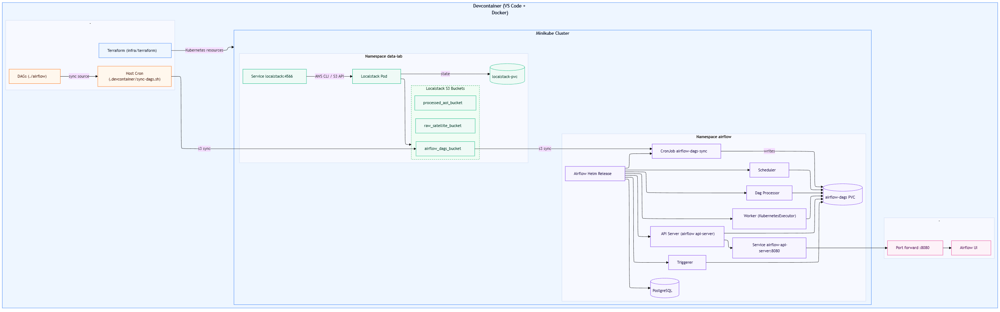
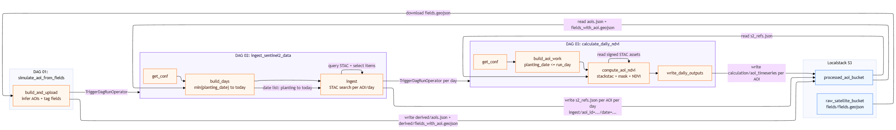

[](https://github.com/nitish-raj/local-datalab/actions/workflows/terraform-validate.yaml)
[](https://github.com/nitish-raj/local-datalab/actions/workflows/python-test.yaml)

# Local Data Lab

Local Data Lab is a containerized, local-first data platform based on Airflow and Localstack (AWS) on Minikube (k8) with IaC using Terraform.

## Architecture Diagram


## Data Flow Diagram (DAGs + Pipeline)



```geojson
{
    "type": "FeatureCollection",
    "name": "fields_with_planting_dates",
    "crs": {
        "type": "name",
        "properties": {
            "name": "urn:ogc:def:crs:OGC:1.3:CRS84"
        }
    },
    "features": [
        {
            "type": "Feature",
            "properties": {
                "field_id": "F001",
                "planting_date": "2026-01-01"
            },
            "geometry": {
                "type": "Polygon",
                "coordinates": [
                    [
                        [
                            5.981582361085373,
                            49.843839468148417
                        ],
                        [
                            6.045924169409432,
                            49.814862290427499
                        ],
                        [
                            6.137394643323546,
                            49.792618642440431
                        ],
                        [
                            6.149838830646104,
                            49.839550641591671
                        ],
                        [
                            6.067066789048511,
                            49.922667846443062
                        ],
                        [
                            6.029908833583306,
                            49.919623777909635
                        ],
                        [
                            5.994228367256596,
                            49.914452910345943
                        ],
                        [
                            5.981582361085373,
                            49.843839468148417
                        ]
                    ]
                ]
            }
        },
        {
            "type": "Feature",
            "properties": {
                "field_id": "F002",
                "planting_date": "2026-01-01"
            },
            "geometry": {
                "type": "Polygon",
                "coordinates": [
                    [
                        [
                            5.904589611221184,
                            50.084859010228996
                        ],
                        [
                            5.91742516073225,
                            49.979042851312187
                        ],
                        [
                            6.077849604023584,
                            50.014934898401009
                        ],
                        [
                            6.086947137891542,
                            50.088224378634209
                        ],
                        [
                            5.904589611221184,
                            50.084859010228996
                        ]
                    ]
                ]
            }
        },
        {
            "type": "Feature",
            "properties": {
                "field_id": "F003",
                "planting_date": "2026-01-01"
            },
            "geometry": {
                "type": "Polygon",
                "coordinates": [
                    [
                        [
                            5.00572716705895,
                            50.332855540147108
                        ],
                        [
                            4.980389969145307,
                            50.271442444152257
                        ],
                        [
                            5.053011906393778,
                            50.186334226955637
                        ],
                        [
                            5.125889921160194,
                            50.233988582259315
                        ],
                        [
                            5.125931960969154,
                            50.295444814398877
                        ],
                        [
                            5.00572716705895,
                            50.332855540147108
                        ]
                    ]
                ]
            }
        },
        {
            "type": "Feature",
            "properties": {
                "field_id": "F004",
                "planting_date": "2026-01-01"
            },
            "geometry": {
                "type": "Polygon",
                "coordinates": [
                    [
                        [
                            7.505518494300873,
                            51.157409464436
                        ],
                        [
                            7.451011029000597,
                            51.079936985529002
                        ],
                        [
                            7.592357102499221,
                            51.018162876287647
                        ],
                        [
                            7.655415304927146,
                            51.119734472402712
                        ],
                        [
                            7.505518494300873,
                            51.157409464436
                        ]
                    ]
                ]
            }
        },
        {
            "type": "Feature",
            "properties": {
                "field_id": "F005",
                "planting_date": "2026-01-01"
            },
            "geometry": {
                "type": "Polygon",
                "coordinates": [
                    [
                        [
                            7.549310877193335,
                            50.272204021063146
                        ],
                        [
                            7.619307990307675,
                            50.118921673410256
                        ],
                        [
                            7.769167731126856,
                            50.172080134086372
                        ],
                        [
                            7.733706828642255,
                            50.288111090814795
                        ],
                        [
                            7.549310877193335,
                            50.272204021063146
                        ]
                    ]
                ]
            }
        },
        {
            "type": "Feature",
            "properties": {
                "field_id": "F006",
                "planting_date": "2026-01-01"
            },
            "geometry": {
                "type": "Polygon",
                "coordinates": [
                    [
                        [
                            6.321730870183046,
                            49.783697702623897
                        ],
                        [
                            6.326552331751657,
                            49.713477848709545
                        ],
                        [
                            6.434076270698228,
                            49.745743310539979
                        ],
                        [
                            6.43354447246449,
                            49.790010160184778
                        ],
                        [
                            6.321730870183046,
                            49.783697702623897
                        ]
                    ]
                ]
            }
        },
        {
            "type": "Feature",
            "properties": {
                "field_id": "F007",
                "planting_date": "2026-01-01"
            },
            "geometry": {
                "type": "Polygon",
                "coordinates": [
                    [
                        [
                            5.978062868139205,
                            49.69562786064796
                        ],
                        [
                            5.960079815419874,
                            49.658537379869102
                        ],
                        [
                            5.966954464925919,
                            49.626095012992948
                        ],
                        [
                            6.071525149114848,
                            49.639531655268456
                        ],
                        [
                            6.113675321822541,
                            49.681367382927789
                        ],
                        [
                            5.978062868139205,
                            49.69562786064796
                        ]
                    ]
                ]
            }
        },
        {
            "type": "Feature",
            "properties": {
                "field_id": "F008",
                "planting_date": "2026-01-01"
            },
            "geometry": {
                "type": "Polygon",
                "coordinates": [
                    [
                        [
                            6.962617377567369,
                            49.813013987023112
                        ],
                        [
                            6.990912300739609,
                            49.747764615669666
                        ],
                        [
                            7.131869516480037,
                            49.738156870033748
                        ],
                        [
                            7.195797828458382,
                            49.811105256751006
                        ],
                        [
                            6.962617377567369,
                            49.813013987023112
                        ]
                    ]
                ]
            }
        },
        {
            "type": "Feature",
            "properties": {
                "field_id": "F009",
                "planting_date": "2026-01-01"
            },
            "geometry": {
                "type": "Polygon",
                "coordinates": [
                    [
                        [
                            7.688218168752599,
                            51.167190539851134
                        ],
                        [
                            7.708766350329483,
                            51.120220425523172
                        ],
                        [
                            7.777870150899332,
                            51.126085245049723
                        ],
                        [
                            7.809781799041673,
                            51.16641132199095
                        ],
                        [
                            7.688218168752599,
                            51.167190539851134
                        ]
                    ]
                ]
            }
        },
        {
            "type": "Feature",
            "properties": {
                "field_id": "F010",
                "planting_date": "2026-01-01"
            },
            "geometry": {
                "type": "Polygon",
                "coordinates": [
                    [
                        [
                            7.714060584180601,
                            51.092790481677071
                        ],
                        [
                            7.656493647408183,
                            51.036049713578564
                        ],
                        [
                            7.745864278056956,
                            51.025978231929514
                        ],
                        [
                            7.801603964416472,
                            51.09087171669961
                        ],
                        [
                            7.714060584180601,
                            51.092790481677071
                        ]
                    ]
                ]
            }
        },
        {
            "type": "Feature",
            "properties": {
                "field_id": "F011",
                "planting_date": "2026-01-01"
            },
            "geometry": {
                "type": "Polygon",
                "coordinates": [
                    [
                        [
                            5.107245152298788,
                            50.185720503725832
                        ],
                        [
                            5.04870023206368,
                            50.136964817740022
                        ],
                        [
                            5.171776333603958,
                            50.142695528438225
                        ],
                        [
                            5.197107211213421,
                            50.19178312730395
                        ],
                        [
                            5.107245152298788,
                            50.185720503725832
                        ]
                    ]
                ]
            }
        },
        {
            "type": "Feature",
            "properties": {
                "field_id": "F012",
                "planting_date": "2026-01-01"
            },
            "geometry": {
                "type": "Polygon",
                "coordinates": [
                    [
                        [
                            7.053736162139813,
                            49.895071118590039
                        ],
                        [
                            6.941655964314606,
                            49.868928808638572
                        ],
                        [
                            6.956797743187224,
                            49.836333528690517
                        ],
                        [
                            7.233986410423455,
                            49.855442340437975
                        ],
                        [
                            7.053736162139813,
                            49.895071118590039
                        ]
                    ]
                ]
            }
        },
        {
            "type": "Feature",
            "properties": {
                "field_id": "F013",
                "planting_date": "2026-01-01"
            },
            "geometry": {
                "type": "Polygon",
                "coordinates": [
                    [
                        [
                            7.757737684006969,
                            50.290945317290976
                        ],
                        [
                            7.791455749988984,
                            50.177502981726889
                        ],
                        [
                            7.863551107456061,
                            50.202927574258467
                        ],
                        [
                            7.875592852058759,
                            50.293387831374702
                        ],
                        [
                            7.757737684006969,
                            50.290945317290976
                        ]
                    ]
                ]
            }
        }
    ]
}
```

### DAG Workflow Summary
- **DAG 01** infers AOIs from field polygons, tags each field with an `aoi_id`, writes outputs under `derived/` (`aois.json`, `fields_with_aoi.geojson`), then triggers DAG 02.
- **DAG 02** builds a daily date range from the **earliest planting date to today**, runs a STAC search per **AOI × day**, writes results under `ingest/` (`ingest/aoi_id=.../date=.../s2_refs.json`), and triggers DAG 03 **for each day**.
- **DAG 03** filters fields by `planting_date ≤ run_day`, unions eligible fields by AOI, computes NDVI per AOI using the day’s ref, and writes outputs under `calculation/` (`calculation/aoi_timeseries/...`).

## System Requirements
- macOS, Linux, or Windows (with WSL2) capable of running Docker
- 4 CPU cores minimum (8 recommended for smoother Minikube + Localstack)
- 8 GB RAM minimum (16 GB recommended)
- 10+ GB free disk space for images, caches, and Terraform providers
- Hardware virtualization enabled (required by Docker Desktop/WSL2)

## Devcontainer Prerequisites
- Docker Desktop or Docker Engine with Compose v2
  - Install: https://docs.docker.com/get-docker/
  - Must allow privileged containers and bind-mounting the repo directory
- VS Code with the Dev Containers extension (or a compatible devcontainer CLI)
- Git
- Network access to pull images and features from Docker Hub/GHCR and Terraform providers
- A local `.env` file at repo root
  - Use the existing `.env` as a template and replace values for your environment as needed

## Run In Devcontainer
1. Open this repo in VS Code.
2. Run "Dev Containers: Reopen in Container".
3. The container build will run `.devcontainer/bootstrap.sh` on first start; it provisions Minikube, applies Terraform, and starts port forwards. This may take 10-20 minutes depending on system resources and network speed.
4. After the container starts, access services:
   - Airflow UI: http://localhost:8080 (default user: `admin`, password: `admin`)
   - Localstack: It does not have a UI, but you can interact with it using AWS CLI or SDKs at `http://localhost:4566`. For example, list S3 buckets with:
      ```
      aws --endpoint-url=http://localhost:4566 s3 ls
      ```
   - Minikube Dashboard: Run `minikube dashboard -p local-datalab --url` in the devcontainer terminal to get the URL.
